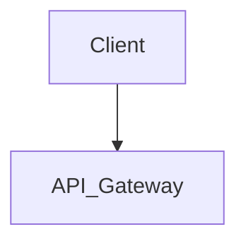

# Architecture Diagram Template

When generating the Architecture Diagram, strictly adhere to the following markdown structure:

## Architecture Diagram
*Include a high-level text description and a Mermaid.js diagram representing the system's component flow.*

