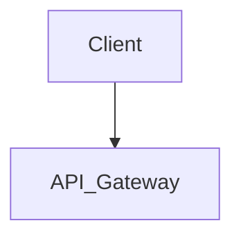

# Architectural Report Template

When generating the final output for the `codebase-discovery` skill, strictly adhere to the following markdown structure.

## Executive Summary
*Provide a 2-paragraph TL;DR of the system's purpose, core tech stack, and overall system health.*

## Architecture Diagram
*Include a high-level text description and a Mermaid.js diagram representing the system's component flow.*

## Deep Dive Sections

### Domain Model & Core Entities
* **Entities & Relationships**: Exhaustive list of all database tables, ORM models, and domain entities:
  * `[Entity Name 1]`: Description of purpose and key relationships (1:N, N:M).
  * `[Entity Name 2]`: Description of purpose and key relationships (1:N, N:M).
  * `...`
* **State Management**: Comprehensive breakdown of persistence strategies:
  * `[Primary database 1]`
  * `[Caching layer 1]`
  * `...`
* **Modeling Issues**: Exhaustive list of all identified bottlenecks:
  * `[Modeling Anti-pattern 1]`: Details...
  * `[Modeling Anti-pattern 2]`: Details...
  * `...`

### API Surface & Integrations
* **API Routes**: Exhaustive list of every API route, method, and corresponding handler:
  * `[API Route 1]`: Controller/Handler, and complete payload structures (request/response).
  * `[API Route 2]`: Controller/Handler, and complete payload structures (request/response).
  * `...`
* **External Dependencies**: Exhaustive list of all third-party integrations:
  * `[Integration 1]`: Details...
  * `[Integration 2]`: Details...
  * `...`
* **Authentication/Authorization**: 
  * `[Authentication Strategy 1]`: Applied to routes...
  * `[Authorization Strategy 1]`: Applied to routes...
  * `...`

### Data Structures, Algorithms & Concurrency
* **Data Structures & Algorithms**: Exhaustive list of custom structures:
  * `[Data Structure 1]`: Processing logic details.
  * `[Algorithm 1]`: Processing logic details.
  * `...`
* **Concurrency Model**: Detailed breakdown of background processing:
  * `[Worker/Process 1]`: Goroutines/threading usage.
  * `[Async/await usage 1]`: Async/await usage.
  * `...`
* **Concurrency Risks**: Comprehensive list of potential issues:
  * `[Potential race condition 1]`: Potential race condition details.
  * `[Deadlock vector 1]`: Deadlock vector details.
  * `...`

### Code Quality & Test Coverage Signals
* **Test Coverage**: Detailed test coverage percentages with a full breakdown:
  * Unit tests.
    * `[Testable entity/module 1]`: `[Percentage]%`
    * `[Testable entity/module 2]`: `[Percentage]%`
    * `...`
  * Integration tests.
    * `[Testable entity/module 1]`: `[Percentage]%`
    * `...`
  * E2E tests.
    * `[Testable entity/module 1]`: `[Percentage]%`
    * `...`
* **Testing Patterns**: Exhaustive evaluation of testing quality:
  * `[Testing Pattern 1]`: Reliance on mocks vs real databases, test suite execution speed/flakiness.
  * `[Testing Pattern 2]`: Details...
  * `...`
* **Code Health Metrics**: Comprehensive metrics across the entire codebase:
  * `[Cyclomatic complexity metric 1]`: Details.
  * `[Duplication metric 1]`: Details.
  * `...`
* **Observability**: Exhaustive list of implementations:
  * `[Metric implementation 1]`: Implementation details.
  * `[Logger implementation 1]`: Implementation details.
  * `[Tracer implementation 1]`: Implementation details.
  * `...`

### Security & Vulnerability Analysis
* **Identified Vulnerabilities**: Exhaustive list of all security risks:
  * `[Vulnerability 1]`: Vulnerability details.
  * `[Vulnerability 2]`: Vulnerability details.
  * `...`
* **Sensitive Data Exposure**: Exhaustive list of risks:
  * `[Secret 1]`: Hardcoded secret found at `[Path]`.
  * `[Misconfigured permission 1]`: Misconfigured permissions at `[Path]`.
  * `...`
* **Dependencies**: Comprehensive list of outdated, insecure, or vulnerable packages:
  * `[Vulnerable dependency 1]`: Vulnerability details.
  * `[Vulnerable dependency 2]`: Vulnerability details.
  * `...`
* **Edge Cases & Gaps**:
  * `[Edge case 1]`: Edge case details.
  * `[Authentication gap 1]`: Authentication gap details.
  * `...`

## The "Red Flags" List
* Immediate technical debt items:
  * `[Technical debt item 1]`
  * `[Technical debt item 2]`
  * `...`
* Scalability ceilings that need addressing before new feature development begins.
  * `[Performance bottleneck 1]`
  * `[Performance bottleneck 2]`
  * `...`

## Recommendations & Next Steps
* Provide a prioritized list of recommended changes to address the identified issues.
  * `[Recommended change 1]`
  * `[Recommended change 2]`
  * `...`
* Suggest architectural improvements or technology migrations that could enhance performance, scalability, and maintainability.
  * `[Recommended architectural improvement 1]`
  * `[Recommended architectural improvement 2]`
  * `...`
* Identify critical security patches that should be applied immediately.
  * `[Recommended security patch 1]`
  * `[Recommended security patch 2]`
  * `...`
* Recommend areas where test coverage should be improved and provide specific guidance on how to implement those improvements.
  * `[Recommended test coverage improvement 1]`
  * `[Recommended test coverage improvement 2]`
  * `...`
