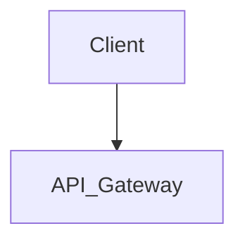

# Architectural Report Template

When generating the final output for the `codebase-discovery` skill, strictly adhere to the following markdown structure. **CRITICAL INSTRUCTION: Whenever this template asks for a list (e.g., `[List all...]`), you MUST output each item on its own dedicated bullet point. NEVER collapse lists into a single comma-separated line.**

## Executive Summary
*Provide a 2-paragraph TL;DR of the system's purpose, core tech stack, and overall system health.*

## Architecture Diagram
*Include a high-level text description and a Mermaid.js diagram representing the system's component flow.*

## Deep Dive Sections

### 1. Domain Model & Core Entities
* **Entities & Relationships**: Exhaustive list of all database tables, ORM models, and domain entities:
  * `[List all entities here. Use a separate bullet for each.]`: Description of purpose and key relationships (1:N, N:M).
* **State Management**: Comprehensive breakdown of persistence strategies:
  * `[List all databases here. Use a separate bullet for each.]`
  * `[List all caching layers here. Use a separate bullet for each.]`
* **Modeling Issues**: Exhaustive list of all identified bottlenecks:
  * `[List all data modeling anti-patterns here. Use a separate bullet for each.]`: Details...

### 2. API Surface & Integrations
* **API Routes**: Exhaustive list of every API route, method, and corresponding handler:
  * `[List all API routes here. Use a separate bullet for each.]`: Controller/Handler, and complete payload structures (request/response).
* **External Dependencies**: Exhaustive list of all third-party integrations:
  * `[List all integrations here. Use a separate bullet for each.]`: Details...
* **Authentication/Authorization**: 
  * `[List all authentication strategies here. Use a separate bullet for each.]`: Applied to routes...
  * `[List all authorization strategies here. Use a separate bullet for each.]`: Applied to routes...

### 3. Data Structures, Algorithms & Concurrency
* **Data Structures & Algorithms**: Exhaustive list of custom structures:
  * `[List all data structures here. Use a separate bullet for each.]`: Processing logic details.
  * `[List all algorithms here. Use a separate bullet for each.]`: Processing logic details.
* **Concurrency Model**: Detailed breakdown of background processing:
  * `[List all workers/processes here. Use a separate bullet for each.]`: Goroutines/threading usage.
  * `[List all async/await usage here. Use a separate bullet for each.]`: Async/await usage.
* **Concurrency Risks**: Comprehensive list of potential issues:
  * `[List all potential race conditions here. Use a separate bullet for each.]`: Potential race condition details.
  * `[List all deadlock vectors here. Use a separate bullet for each.]`: Deadlock vector details.

### 4. Code Quality & Test Coverage Signals
* **Test Coverage**: Detailed test coverage percentages with a full breakdown:
  * Unit tests.
    * `[List all testable entities/modules here. Use a separate bullet for each.]`: `[Percentage]%`
  * Integration tests.
    * `[List all testable entities/modules here. Use a separate bullet for each.]`: `[Percentage]%`
  * E2E tests.
    * `[List all testable entities/modules here. Use a separate bullet for each.]`: `[Percentage]%`
* **Testing Patterns**: Exhaustive evaluation of testing quality:
  * `[List all testing patterns here. Use a separate bullet for each.]`: Reliance on mocks vs real databases, test suite execution speed/flakiness.
* **Code Health Metrics**: Comprehensive metrics across the entire codebase:
  * `[List all cyclomatic complexity metrics here. Use a separate bullet for each.]`: Details.
  * `[List all duplication metrics here. Use a separate bullet for each.]`: Details.
* **Observability**: Exhaustive list of implementations:
  * `[List all metric implementations here. Use a separate bullet for each.]`: Implementation details.
  * `[List all logger implementations here. Use a separate bullet for each.]`: Implementation details.
  * `[List all tracer implementations here. Use a separate bullet for each.]`: Implementation details.

### 5. Security & Vulnerability Analysis
* **Identified Vulnerabilities**: Exhaustive list of all security risks:
  * `[List all vulnerabilities here. Use a separate bullet for each.]`: Vulnerability details.
* **Sensitive Data Exposure**: Exhaustive list of risks:
  * `[List all secrets here. Use a separate bullet for each.]`: Hardcoded secret found at `[Path]`.
  * `[List all misconfigured permissions here. Use a separate bullet for each.]`: Misconfigured permissions at `[Path]`.
* **Dependencies**: Comprehensive list of outdated, insecure, or vulnerable packages:
  * `[List all vulnerable dependencies here. Use a separate bullet for each.]`: Vulnerability details.
* **Edge Cases & Gaps**:
  * `[List all edge cases here. Use a separate bullet for each.]`: Edge case details.
  * `[List all authentication gaps here. Use a separate bullet for each.]`: Authentication gap details.

## The "Red Flags" List
* Immediate technical debt items:
  * `[List all technical debt items here. Use a separate bullet for each.]`
* Scalability ceilings that need addressing before new feature development begins.
  * `[List all performance bottlenecks here. Use a separate bullet for each.]`

## Recommendations & Next Steps
* Provide a prioritized list of recommended changes to address the identified issues.
  * `[List all recommended changes here. Use a separate bullet for each.]`
* Suggest architectural improvements or technology migrations that could enhance performance, scalability, and maintainability.
  * `[List all recommended architectural improvements here. Use a separate bullet for each.]`
* Identify critical security patches that should be applied immediately.
  * `[List all recommended security patches here. Use a separate bullet for each.]`
* Recommend areas where test coverage should be improved and provide specific guidance on how to implement those improvements.
  * `[List all recommended test coverage improvements here. Use a separate bullet for each.]`
